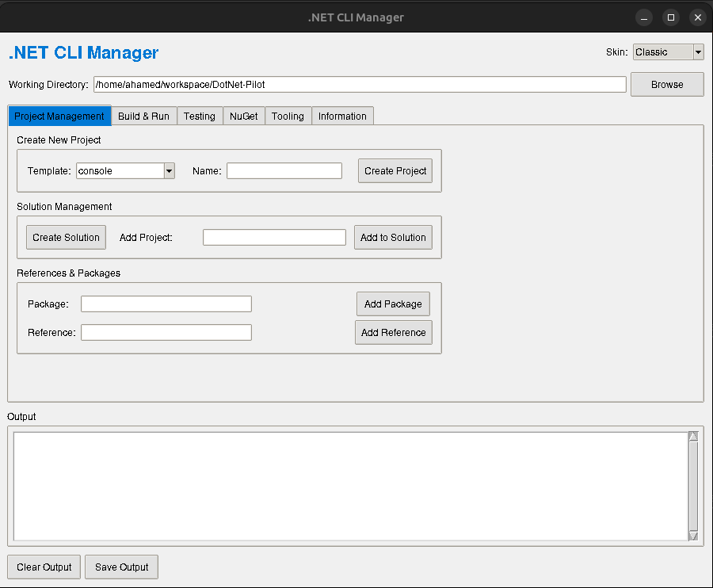

# DotNet-Pilot

A GUI-based tool to simplify working with the .NET CLI, made with Python and Tkinter.



## Features

- **Project Management**: Create projects, manage solutions, add packages and references
- **Build & Run**: Build, run, clean, restore, and publish .NET projects with various configurations
- **Testing**: Create and run test projects with coverage options
- **NuGet**: Package management and publishing capabilities
- **Tooling**: Install, update, and manage .NET tools
- **Information**: View system information, SDKs, and runtimes
- **16 Visual Themes**: Including Classic, Dark, Neon, Blue Ocean, Sunset, Forest, Cyberpunk, Monokai, Solarized, Dracula, Nord, Gruvbox, One Dark, Material, and Tokyo Night

## Usage

To run this application, you need Python 3.9 or higher. All dependencies are included in the Python standard library.

```bash
python main.py
```

The GUI provides a user-friendly interface for various `dotnet` CLI commands, organized into tabs for different functionalities.

## Contributing

Contributions are welcome! Please read our [contributing guidelines](docs/contributing.md) to get started.

## License

This project is licensed under the MIT License. See the [LICENSE](LICENSE) file for details.

## Badges


